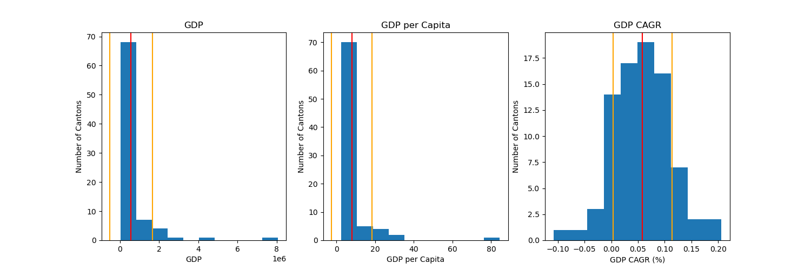

# Statistics summary

## Goal
Explore basic statistical metrics and interpretation

## Summary table
| Variable | Mean | Median | StDev |
|---|---|---|---|
| GDP | 560334 | 206657 | 1085374 |
| GDP per capita | 7.92 | 5.06 | 10.42 |
| GDP CAGR | 0.06 | 0.06 | 0.06 |

## Histogram

## Interpretation
- GDP shows a highly right-skewed distribution. The mean is significantly higher than the median, indicating that a large share of economic activity is concentrated in a few cantons. The economic centers are clear and significant outliers, representing a strong economic concentration in few cantones.

- The GDP per capita has a similar right-skewed pattern to GDP, indicating that economic producitivity is concentrated in a small number of cantones. A small number of cantones generate significantly higher economic output per person.

- The GDP CAGR shows an approximately normal distribution centered at 6% indicated by similar mean and median values. During the period, most cantones experienced positive economic growth, and relatively few showed exceptional growth or contraction. The standard deviation indicates a moderate variation in growth rate across cantones.

## Conclusion

The results show that both economic output and economic productivity are strongly concentrated in a small number of cantones. However, during the 2019 to 2022 period, economic growth was evenly distribuited across all cantones.