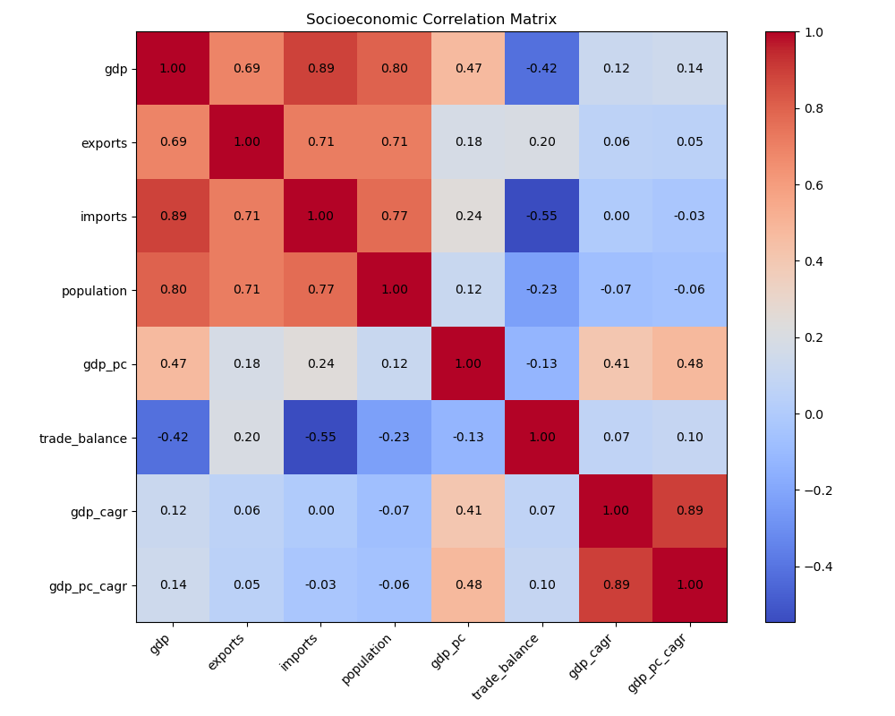

# Correlation interpretation

## Goal
Explore the correlation between some socioeconomic factors

## Correlation heatmap

## Interpretation
- Based on the strong correlation between GDP, population and imports/exports, larger *cantones* tend to have larger economies and thus, a more dynamic trade environment.

- In relation to this, *cantones* with larger economies tend to have a trade deficit, implying that in general, they import more goods and services than what they export, showcasing the strong inter-*canton* dependencies in matching the population's need for goods and services.

- Wealth per resident seems to vary independetly from a *canton*'s population and imports.

- The GDP, trade behavior and population of the *cantones* doesn't seem to be related to its economic growth rate.

## Conclusion

The correlation analysis reveals two distinct patterns. First, indicators of economic size, including GDP, imports, exports, and population, are strongly interconnected, suggesting that larger *cantones* generally support greater economic and trade activity. Second, growth-related variables exhibit weak correlations with most measures of current economic size, indicating that larger economies are not necessarily the fastest-growing economies. These findings highlight the importance of distinguishing between indicators that describe the current scale of economic activity and those that describe economic performance over time.