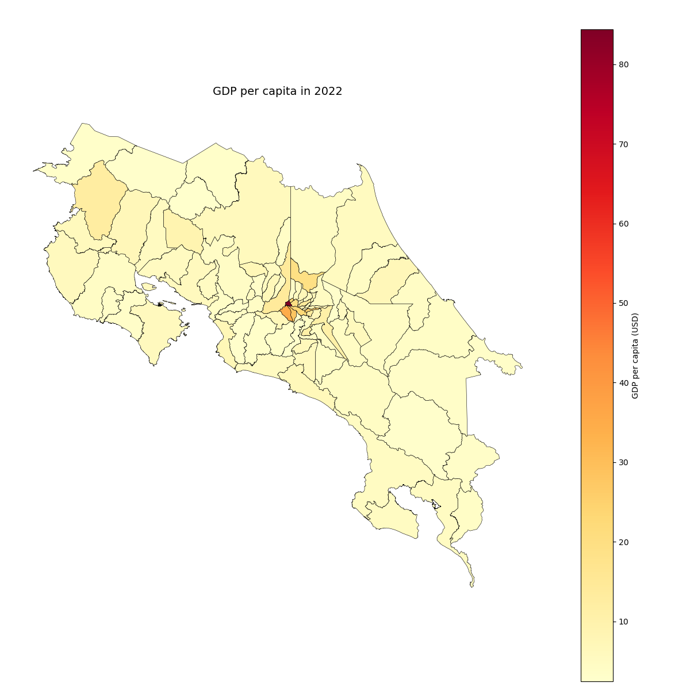
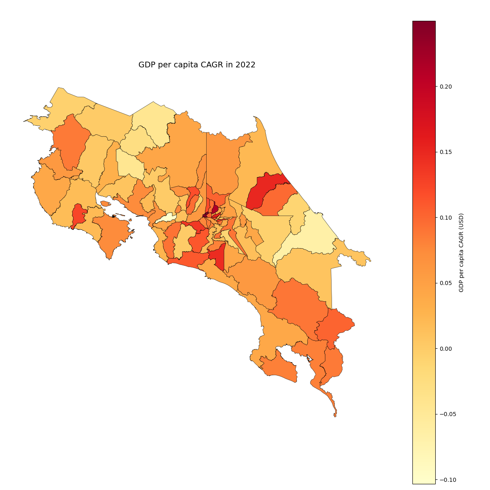

# Geopandas - Week 6

## Goal
Perform more data manipulation using Geopandas, including spatial calculations.

## Results
### Exercise 1
Reusable function for creating choropleths was completed.

### Exercise 2
Choropleths were succesfully generated for GDP per capita and GDP per capita growth (CAGR) using the function created in Exercise 1.

### Exercise 3
CRS was visualized and reprojected sucessfully.
Initial CRS: 4326 (WGS84)
Reprojected CRS: 5367 (CRTM05 - Official Costa Rican CRS)

### Exercise 4
Centroids were succesfully generated and the area (in km2) of each *canton* was also calculated. 

### Exercise 5
A spatial metrics table was generated, allowing to list *cantones* by highest to smallest GDP/km2. The top 3 cantones in this list are San Jose, Belen and Montes de Oca.

## Reflection
- A CRS defines how geographic locations are presented in space. It also works as a framework for spatial calculations and visualizations.

- The projected coordinate systems matter because they use linear units of measurement, allowing for accurate calculations of geometry-based metrics.

- Geometry-based metrics are based on the CRS. Using a projected CRS ensures that the calculations are performed using linear units instead of geographic coordinates.

- In contrast with QGIS, GeoPandas allows for geospatial workflows to be automated, reproduced and reused through code, for example the generation of multiple maps. Also, debugging and testing can be faster because individual steps can be inspected directly.

## Conclusion
These exercises demonstrated that GeoPandas combines GIS concepts with Python programming, allowing for the creation of functions, versatile data manipulation, and generating reusable workflows.